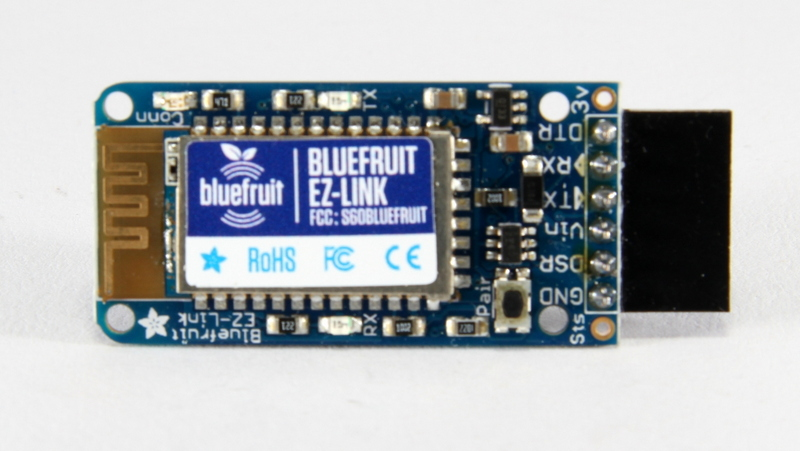
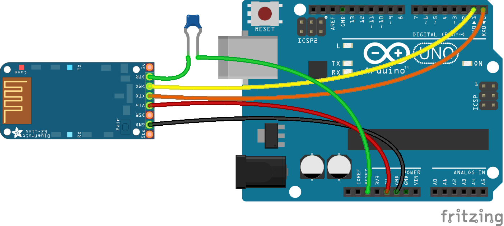

# Bluetooth Erweiterung

Die Bluetooth Erweiterung ermöglicht die Fernbedienung des Roboter über Bluetooth. Mit dem Adafruit BLuetooth EZ-Link ist es auch möglich, den Arduino über Bluetooth zu programmieren.

## Was wird benötigt?

* Adafruit Bluetooth EZ Link Modul
* Arduino Pro 5V/16MHz
* oder 10polige Stiftleiste, 100nF Kondensator für Arduino Uno

## Durchführung

Leider funktioniert dies Erweiterung nicht so ohne weiteres mit dem Arduino Uno. Einfacher geht es mkt einem Arduino Pro. Dort kann man einfach das Bluetooth Modul an der 6-poligen FTDI -Stiftleite anstecken. fertig.

## Verdrahtung Arduino Pro

## Verdrahtung Arduino Uno

## Arduino Sketch

t.b.c

