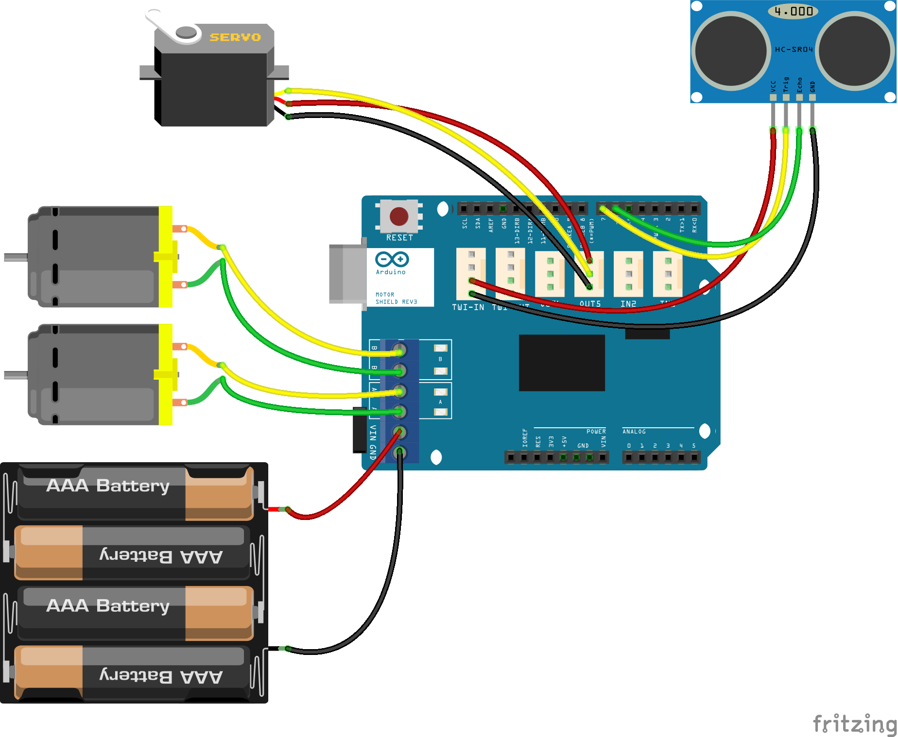

# Ultraschallsensor Erweiterung

Der Ultraschall Sensor kann anstelle des Sharp Infrarotsensors eingesetzt werden. Der Sensor hat einen breiteren Erfassungswinkel. Auf das Scannen der Umgebung mit dem Servo kann weitestgehend verzichtet werden.

## Was wird benötigt?

* HC-SR04 Ultraschallsensor
* 4-polige Buchsenleisten
* 4-polige Stiftleiste
* 4 Drähte 15cm lang
* Plexiglas Halterung (im Roboter Starer Kit enthalten)
* Lötkolben, Seitenschneider

## Durchführung

Der Sensor wird gemäß Verdrahtungs Schema verdrahtet und mit der Plexiglas Halterung am Servo Horn befestigt


## Verdrahtung



## Arduino Sketch

Das Auslesen des Sensors ist Teil der Watterott Roboter Starter Kit (WRSK) Bibliothek.

```arduino
#ifndef ULTRASONIC_H
#define ULTRASONIC_H

#if defined(ARDUINO) && ARDUINO >= 100
#include "Arduino.h"
#else
#include "WProgram.h"
#endif

class WRSK_UltrasonicSensor {
  public:
    WRSK_UltrasonicSensor(int _echoPin, int _triggerPin);
    WRSK_UltrasonicSensor(int _echoPin, int _triggerPin, int dbgLevel);
    float read(void);
    float readcm(void);
    float readinch(void);

  private:
    int echoPin;
    int triggerPin;
    int dbgLevel;
    int readRAW(void);
    void initUltrasonicSensor(void);
    float microsecondsToInches(int microsecond);
    float microsecondsToCentimeters(int microsecond);
};

#endif /* ULTRASONIC_H */
```


```arduino
#include "WProgram.h"
#endif


#include "WRSK_UltrasonicSensor.h" 

WRSK_UltrasonicSensor::WRSK_UltrasonicSensor(int _echoPin, int _triggerPin)
{
  this->echoPin = _echoPin;
  this->triggerPin = _triggerPin;
  this->dbgLevel = 0;
  initUltrasonicSensor();
}

WRSK_UltrasonicSensor::WRSK_UltrasonicSensor(int _echoPin, int _triggerPin, int _dbgLevel)
{
  this->echoPin = _echoPin;
  this->triggerPin = _triggerPin;
  this->dbgLevel = _dbgLevel;
  initUltrasonicSensor();
}

float WRSK_UltrasonicSensor::read(void)
{
  return readcm();
}

float WRSK_UltrasonicSensor::readcm(void)
{
  int pulsein;
  float distance;

  pulsein = readRAW();
  distance = microsecondsToCentimeters(pulsein);
  if (distance < 4 && distance > 60)
  {
    distance = -1;
  }
  if (this->dbgLevel > 1) 
  {
    Serial.print("Distance: ");
    Serial.print(distance, DEC);
    Serial.println(" cm");
  }
  return distance;
} 

float WRSK_UltrasonicSensor::readinch(void)
{
  int pulsein;
  float distance;

  pulsein = readRAW();
  distance = microsecondsToInches(pulsein);
  if (distance < 2 && distance > 24)
  {
    distance = -1;
  }
  if (this->dbgLevel > 1) 
  {
    Serial.print("Distance: ");
    Serial.print(distance, DEC);
    Serial.println(" in");
  }
  return distance;
} 


int WRSK_UltrasonicSensor::readRAW(void)
{
  int pulsein;
  // The HC-SR04 is triggered by a HIGH pulse of 10 or more microseconds.
  digitalWrite(this->triggerPin, HIGH);
  delayMicroseconds(10);
  digitalWrite(this->triggerPin, LOW);
 
  // The same pin is used to read the signal from the HC-SR04 a HIGH
  // pulse whose duration is the time (in microseconds) from the sending
  // of the ping to the reception of its echo off of an object.
  pulsein = pulseIn(this->echoPin, HIGH);
  return pulsein;
} 

void WRSK_UltrasonicSensor::initUltrasonicSensor(void)
{
  pinMode(this->triggerPin, OUTPUT);
  pinMode(this->echoPin, INPUT);
  digitalWrite(this->triggerPin, LOW);
}

float WRSK_UltrasonicSensor::microsecondsToInches(int microseconds)
{
  // According to Parallax's datasheet for the PING))), there are
  // 73.746 microseconds per inch (i.e. sound travels at 1130 feet per
  // second).  This gives the distance travelled by the ping, outbound
  // and return, so we divide by 2 to get the distance of the obstacle.
  return microseconds / 74.0 / 2.0;
}
 
float WRSK_UltrasonicSensor::microsecondsToCentimeters(int microseconds)
{
  // The speed of sound is 340 m/s or 29 microseconds per centimeter.
  // The ping travels out and back, so to find the distance of the
  // object we take half of the distance travelled.
  return microseconds / 29.0 / 2.0;
}
```

Das Beispiel Sketch zum Kollionsvermeider (examples/ObstacleAvoiding) 

```arduino
/*
  ObstacleAvoiding.ino - Watterott Starter Robot Kit (WSRK)
  Author: RobotFreak www.robotfreak.de/blog
  Copyright (c) 2015 RobotFreak All Rights Reserved
 
  For information about the Watterott Starter Robot Kit (WSRK)
  visit http://www.watterott.com/de/StarterKit-Roboter
 
  The minimum circuit:
  * Watterott Starter Robot Kit (WSRK) Arduino Uno + Arduino Motor Shield 
  * Sharp GP2D12 or GP2D120 Infrared distance sensor connected to A3
  * or HC-SR04 Ultrasonic distance sensor connected to pin 6, 7
  * USB cable

  Alternative circuit:
  * Watterott Starter Robot Kit (WSRK) Arduino Pro + Arduino Motor Shield 
  * FTDI compatible USB serial module/cable
  * Sharp GP2D12 or GP2D120 Infrared distance sensor connected to A3
  * or HC-SR04 Ultrasonic distance sensor connected to pin 6, 7
  * optional Adafruit Bluefruit EZ-Link Module connected to FTDI connector

 */
#include <inttypes.h>
#include <Servo.h>
#include "iomapping.h"
#include <WRSK_UltrasonicSensor.h>
#include <WRSK_MotorControl.h>

#define DEBUG_LEVEL 2

#define LOW_SPEED 50
#define MID_SPEED 70
#define TOP_SPEED 100

WRSK_MotorControl motors( m1DirectionControl, m1SpeedControl, m2DirectionControl, m2SpeedControl, DEBUG_LEVEL);
WRSK_UltrasonicSensor us(usEchoPin, usTriggerPin, DEBUG_LEVEL);

int speed_l;
int speed_r;
int dly;
float distance;
int debugLevel = DEBUG_LEVEL;

Servo SensorServo;  // Mit diesem Element wird der Servo gesteuert

void setup() {

  Serial.begin(38400);                 // Sets the baud rate to 38400
  speed_l = 0;
  speed_r = 0;
  // Servo initialiseren und auf 90° stellen
  SensorServo.attach( servoPin );
  SensorServo.write( 90 );
  delay( 500 );

  Serial.println("WMR-SHR obstacle Avoiding Version 1.0");   

  distance = us.read();  // get distance
  while (distance > 10.0)
  {
    distance =  us.read();  // get distance
    delay(100);
  }
  Serial.println("Let's go");
}


void loop()
{
  int i;

  distance =  us.read();  // get distance

  if (distance > 0.0)
  {
    if (distance <= 10.0)
    {
      motors.driveWheels(0,0);
      delay(500);
      speed_l = -MID_SPEED;
      speed_r = MID_SPEED;
      dly = 5;
      do {
        distance =  us.read();  // get distance
        delay(40);
        motors.driveWheels(speed_l, speed_r);
        //      motors.driveWheelsRamp(speed_l, speed_r, dly);
      } 
      while(distance < 20.0);  
      speed_l = 0;
      speed_r = 0;
      motors.driveWheels(speed_l,speed_r);
      //    motors.driveWheelsRamp(speed_l, speed_r, dly);
      delay(500);
    }
    else if (distance < 30.0)
    {
      speed_l = MID_SPEED;
      speed_r = MID_SPEED;
    }
    else
    {
      speed_l = TOP_SPEED;
      speed_r = TOP_SPEED;
    }
    dly = 10;
    motors.driveWheels(speed_l, speed_r);
    //  motors.driveWheelsRamp(speed_l, speed_r, dly);
  }

  delay(40);

}
```
