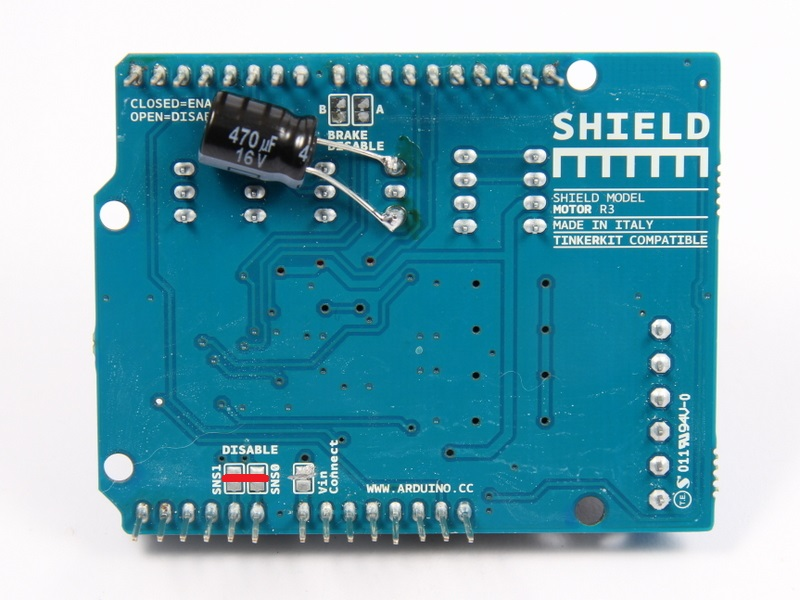
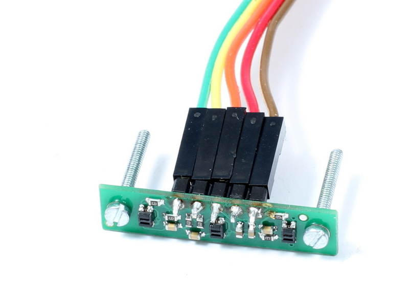
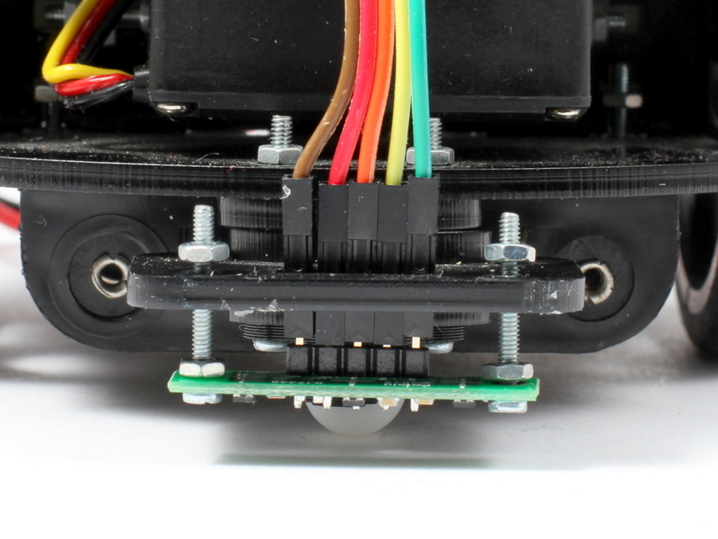
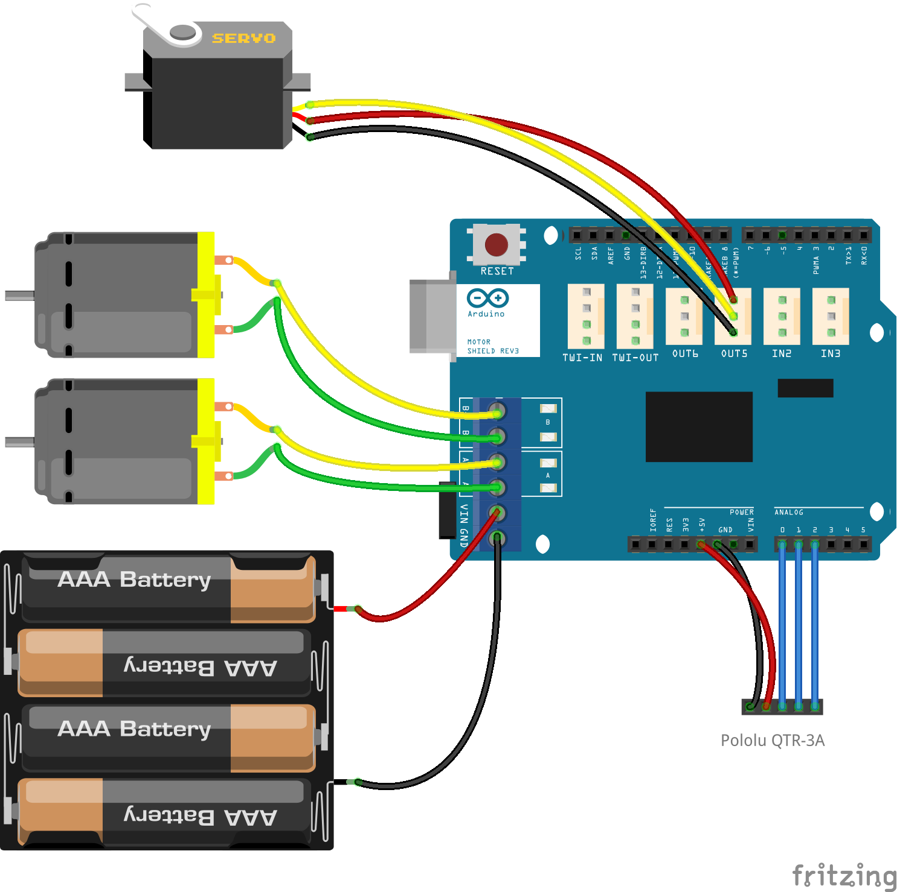

# Liniensensor Erweiterung

Mit dieser  Erweiterung kann der Roboter einen schwarzen Linie auf weißem Unterrund folgen

## Was wird benötigt?

* Pololu QTR-3A Liniensensor (analog)
* 5 polige Buchsenleiste 
* 5 polige Stiftleiste 
* 2 polige Stiftleiste 
* 2 Schrauben M2x15, 4 Muttern M2
* Lötkolben, Seitenschneider, Dremel
* schwarzes Isolier Klebeband 10mm breit
* Plexiglas Halterung (im Roboter Kit enthalten)

## Durchführung

* Es müssen die beiden Lötbrücken SNS1 und SNS2 am Motor Shield entfernt werden.
* Die Verbindung Sensor / Arduino Shield erfolgt mit den Drähten, Buchsen- und Stiftleisten
* Der Sensor wird mit den M2 Schrauben und Muttern und der Plexiglas Halterung am Roboter Starter Kt befestigt 


 





## Verdrahtung



## Arduino Sketch

Es wird die Pololu QTR Bibliothek benötigt: https://github.com/pololu/qtr-sensors-arduino

```arduino
/*
 LineFollower.ino - Watterott Starter Robot Kit (WSRK) line follower
 
  Author: RobotFreak www.robotfreak.de/blog
  Copyright (c) 2015 RobotFreak All Rights Reserved
 
  For information about the Watterott Starter Robot Kit (WSRK)
  visit http://www.watterott.com/de/StarterKit-Roboter

  The minimum circuit:
  * Watterott Starter Robot Kit (WSRK) Arduino Uno + Arduino Motor Shield 
  * Pololu QTR-3RC or QTR-3A Line sensor connected to A0,A1,A2
  * HC-SR04 Ultrasonic distance sensor connected to pin 6, 7
  * USB cable

  Alternative circuit:
  * Watterott Starter Robot Kit (WSRK) Arduino Pro + Arduino Motor Shield 
  * FTDI compatible USB serial module/cable
  * Pololu QTR-3RC or QTR-3A Line sensor connected to A0,A1,A2
  * optional Adafruit Bluefruit EZ-Link Module connected to FTDI connector
 
*/
#include <Servo.h>
#include <QTRSensors.h>
#include <PID_v1.h>
#include "iomapping.h"
#include <WRSK_UltrasonicSensor.h>
#include <WRSK_SharpSensor.h>
#include <WRSK_MotorControl.h>

#define LOW_SPEED 50
#define MID_SPEED 70
#define TOP_SPEED 100

#define BUFFERSIZE 20
#define DEFAULT_speedMultiplier 5 
//#define USE_BLUETOOTH_SERIAL2    // we use Bluetooth over Serial2

// ** GENERAL SETTINGS ** - General preference settings
#define DEBUG_LEVEL 2
int debugLevel = DEBUG_LEVEL;
boolean DEBUGGING = true; // Whether debugging output over serial is on by defauly (can be flipped with 'h' command)

WRSK_MotorControl motors( m1DirectionControl, m1SpeedControl, m2DirectionControl, m2SpeedControl, DEBUG_LEVEL);

int speedMultiplier = DEFAULT_speedMultiplier; // Default speed setting. Uses a range from 1-10 

// No config required for these parameters
unsigned long stopTime=millis(); // used for calculating the run time for motors

//Define Variables we'll be connecting to
double Setpoint, Input, Output;

//Define the aggressive and conservative Tuning Parameters
double aggKp=4, aggKi=0.2, aggKd=1;
double consKp=1, consKi=0.0, consKd=0.0;
//double consKp=1, consKi=0.05, consKd=0.25;

//Specify the links and initial tuning parameters
PID myPID(&Input, &Output, &Setpoint, consKp, consKi, consKd, DIRECT);

Servo myServo;

void setup() 
{
  myServo.attach(servoPin);
  myServo.write(90);

  Serial.begin(38400);
#ifdef USE_BLUETOOTH_SERIAL2
  Serial2.begin(115200);
#endif
  if (debugLevel) { Serial.println("MURCS Line Follower V1.0");  }
  initLineFollow();
//  initLineFollowPID();
  
} 


// Stop the bot
void stopBot() 
{
  motors.driveWheels(0,0);
  if (debugLevel){ Serial.println("Stopping both wheels"); 
  }
  serialReply("i", "st"); // Tell the phone that the robot stopped
}

// sensors 0 through 2 are connected to analog inputs 0 through 2, respectively
QTRSensorsRC qtr((unsigned char[]) {line1Pin, line2Pin, line3Pin}, 
  NUM_LINESENSORS);
unsigned int sensorValues[NUM_LINESENSORS];


void initLineSensors(int debugLevel)
{
  delay(1000);
  for (int i = 0; i < 10; i++)  // make the calibration take about 1.25 seconds
  {
    qtr.calibrate();       // reads all sensors 10 times at 2.5 ms per six sensors (i.e. ~25 ms per call)
    motors.driveWheels(-LOW_SPEED,LOW_SPEED);
  }
  motors.driveWheels(0,0);
  delay(500);
  for (int i = 0; i < 15; i++)  // make the calibration take about 2.5 seconds
  {
    qtr.calibrate();       // reads all sensors 10 times at 2.5 ms per six sensors (i.e. ~25 ms per call)
    motors.driveWheels(LOW_SPEED,-LOW_SPEED);
  }
  motors.driveWheels(0,0);
  delay(500);
  for (int i = 0; i < 10; i++)  // make the calibration take about 1.25 seconds
  {
    qtr.calibrate();       // reads all sensors 10 times at 2.5 ms per six sensors (i.e. ~25 ms per call)
    motors.driveWheels(-LOW_SPEED,LOW_SPEED);
  }
  motors.driveWheels(0,0);
  delay(500);
  // print the calibration minimum values measured when emitters were on
  if (debugLevel > 1)
  {
    for (int i = 0; i < NUM_LINESENSORS; i++)
    {
      Serial.print(qtr.calibratedMinimumOn[i]);
      Serial.print(' ');
    }
    Serial.println();
  
    // print the calibration maximum values measured when emitters were on
    for (int i = 0; i < NUM_LINESENSORS; i++)
    {
      Serial.print(qtr.calibratedMaximumOn[i]);
      Serial.print(' ');
    }
    Serial.println();
    Serial.println();
  }
  delay(1000);
}


unsigned int  readLineSensors(int debugLevel)
{
  // read calibrated sensor values and obtain a measure of the line position from 0 to 5000
  // To get raw sensor values, call:
  //  qtra.read(sensorValues); instead of unsigned int position = qtra.readLine(sensorValues);
  unsigned int position;
  static int count = 0;

//  qtr.read(sensorValues);
  position = qtr.readLine(sensorValues);
  
  if (debugLevel > 1)
  {
  // print the sensor values as numbers from 0 to 1000, where 0 means maximum reflectance and
  // 1000 means minimum reflectance, followed by the line position
    for (unsigned char i = 0; i < NUM_LINESENSORS; i++)
    {
      Serial.print(sensorValues[i]);
      Serial.print('\t');
    }
    //Serial.println(); // uncomment this line if you are using raw values
    Serial.println(position); // comment this line out if you are using raw values
  }
  if (count > 10)
  {
//    Serial2.write((position >> 8) & 0xFF);
//    Serial2.write(position & 0xFF);
    count = 0;
  }
  return position;
}

void initLineFollow()
{
//  myServo.write(90);
  initLineSensors(debugLevel);
}

void initLineFollowPID()
{
//  myServo.write(90);
  initLineSensors(debugLevel);
  Input = 0.0;
  Setpoint = 0.0;
  //tell the PID to range between -50 and 50 
  myPID.SetOutputLimits(-2000, 2000); 
  //turn the PID on
  myPID.SetMode(AUTOMATIC);
}


// Replies out over serial and handles pausing and flushing the data to deal with Android serial comms
void serialReply(char* sensorname, char* tmpmsg) 
{
#ifdef USE_BLUETOOTH_SERIAL2
  Serial2.print(sensorname);
  Serial2.print(":");
  Serial2.println(tmpmsg); // Send the message back out the serial line
  //Wait for the serial debugger to shut up
  delay(200); //this is a magic number
  Serial2.flush(); //clears all incoming data
#else
  Serial.print(sensorname);
  Serial.print(":");
  Serial.println(tmpmsg); // Send the message back out the serial line
  //Wait for the serial debugger to shut up
  delay(200); //this is a magic number
  Serial.flush(); //clears all incoming data
#endif
}

// Check if enough time has elapsed to stop the bot and if it is safe to proceed
void checkIfStopBot() 
{
  if (stopTime < millis()) 
  {
    stopBot();
  }
}

void doLineFollow()
{
  int speed_l, speed_r;
  unsigned int position;

  position = readLineSensors(debugLevel);

  if (position < 500)
  {  // far to the right                                    
    if (debugLevel > 2) { Serial.println("far to the right");}
    speed_l = MID_SPEED;
    speed_r = -LOW_SPEED;
  }
  else if (position > 1500)
  {  // far to the left
    if (debugLevel > 2) { Serial.println("far to the left");}
    speed_l = -LOW_SPEED;
    speed_r = MID_SPEED;
  }
  else
  {  // centered on line 
    if (debugLevel > 2) { Serial.println("on line");}
    speed_l = MID_SPEED;
    speed_r = MID_SPEED;
  }
  stopTime = motors.driveWheels(speed_l, speed_r);
  delay(20); 
}

void doLineFollowPID()
{
  int speed_l, speed_r, speedDiff;
  int position;

  position = readLineSensors(0);
  Input = position - 2000.0;
  myPID.Compute();

  speedDiff = map(abs((int)Output), -2000, 2000, -50, 50);
//  if (Output < 0.0)
//  speedDiff = -speedDiff;
  if (debugLevel > 1) 
  {
    Serial.print("Input: ");
    Serial.print(Input, DEC);
    Serial.print(" Output: ");
    Serial.print(Output, DEC);
    Serial.print(" SDiff: ");
    Serial.println(speedDiff, DEC);
  }
//  speedDiff = (int) power_difference;
  // Compute the actual motor settings.  We never set either motor
  // to a negative value.
  const int max = TOP_SPEED;
  if(speedDiff > max)
      speedDiff = max;
  if(speedDiff < -max)
      speedDiff = -max;
 
  if(speedDiff < 0)
     stopTime = motors.driveWheels(max+speedDiff, max);
  else
     stopTime =  motors.driveWheels(max, max-speedDiff);
  delay(40); 
}


// Main loop running at all times
void loop() 
{
  doLineFollow();
  checkIfStopBot();
}
```


