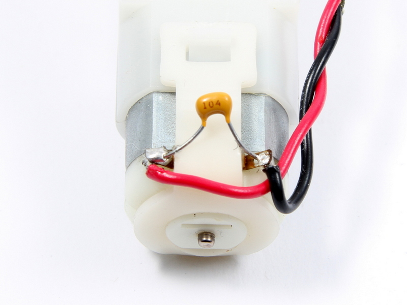

#Motoren entstören

Die Motoren des Starter Kits sind Gleichstrom Getriebemotoren (Solarbotics GM9). Die Bürsten der Gleichstrommotoren erzeugen ordentlich Störungen auf den elektrischen Verbindungen und können auch andere Elektronik, insbesondere Sensoren beeinflussen. Grundsätzlich  sollten Motoren entstört werden, egal ob Störungen auftreten oder nicht. Dazu wird je Motor ein Keramik-Kondensatoren (KerKo) mit ca. 100nF benötigt. Dieser Kondensator wird einfach parallel über die Motoranschlüsse gelötet.

##Benötigte Bauteile:

* 2 x <a href="http://www.reichelt.de/Vielschicht-bedrahtet-Z5U-20-/Z5U-2-5-100N/3//index.html?ACTION=3&GROUPID=3163&ARTICLE=22977&OFFSET=16&WKID=0&">100nF Keramik-Kondensatoren</a>

