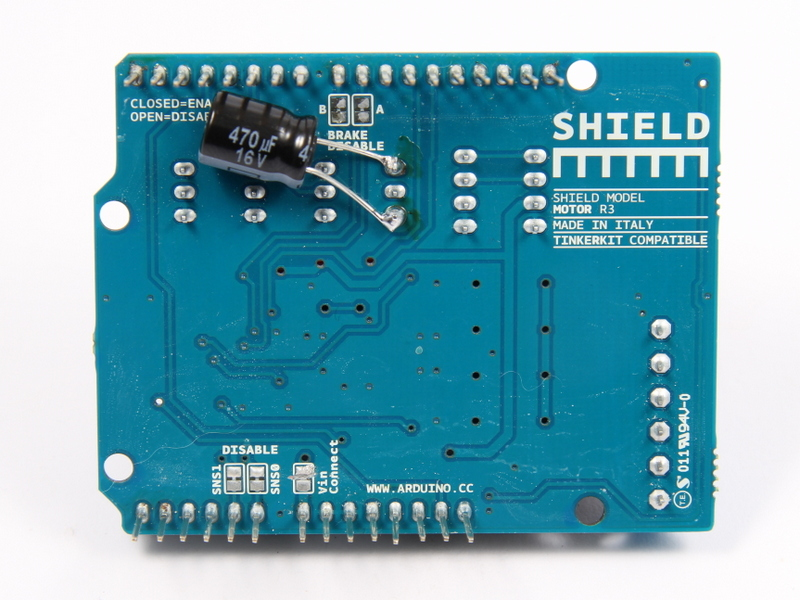

#Servo Spannungsversorgung Modifikation

Der Servo für den Front-Sensor ist eine weitere Störquelle. Beim Anfahren zieht er besonders viel Strom, was zu kurzen Spannungseinbrüchen führen kann. Da die 4 AA Zellen eh schon zu knapp bemessen sind für einen sicheren Betrieb, kann dies zu einem Reset des Arduino Boards führen. Abhilfe ist auch hier durch einen Elektrolyt Kondensator (Elko) von 470..1000µF möglich, der in die Versorgungsleitung zum Servo gehängt wird. Dieser versorgt den Servo mit dem nötigen Strom, ohne das es größere Spannungseinbrüche gibt.

Der Elko wird auf die Rückseite des Motor Shields auf die Anschlüsse von Out ~6 gelötet. Dabei muss die Polung des Elkos berücksichtigt werden. 

##Benötigte Bauteile:

* <a href="http://www.reichelt.de/Elkos-radial-105-C-1000-5000h/RAD-FC-1-000-10/3//index.html?ACTION=3&GROUPID=4000&ARTICLE=84694&OFFSET=16&WKID=0&">Elko radial, 105°C, low ESR, 1000µF, 10V</a
