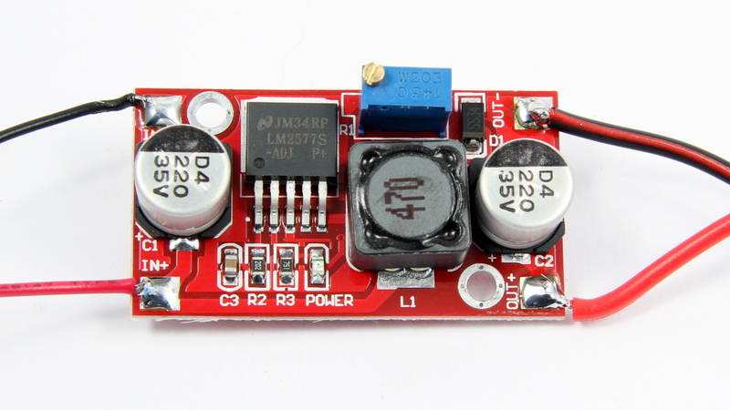
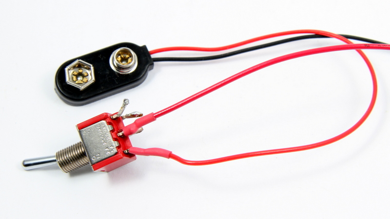

#Stromversorgungs Modifikation

Bei dieser Variante wird die Batteriespannung mit Hilfe eines Step-Up Wandlers auf einen Wert im empfohlenen Eingangsbereich hochgeregelt und stabilisiert. Umbauten am Motor-Shield sind nicht notwendig. Ein geeigneter Step-Up Wandler ist z.B. der LM2577. Diesen gibt als fertiges Modul auf eBay, DealExtreme oder Amazon. Der Wandler generiert aus einer Eingangsspannung im Bereich von 3..30V eine regelbare Ausgangsspannung von 4..30V. Bei einem <a href="http://de.wikipedia.org/wiki/Aufw%C3%A4rtswandler">Aufwärtswandler</a> wird niedrige Eingangsspannung in eine höhere Ausgangsspannung gewandelt. Achtung, die Module können sehr leicht verwechselt werden mit Step-Down Wandlern mit LM2596 IC. Das sind <a href="http://de.wikipedia.org/wiki/Abw%C3%A4rtswandler">Abwärtswandler</a>, die aus einer größeren Eingangsspannung eine kleinere Ausgangsspannung machen.

Der Step-Up Wandler wird zwischen Batteriefach und der Stromversorgung für das Motor Shield mit eingebaut. Bei der Gelegenheit sollte man auch gleich einen Kippschalter zum Ein-/Ausschalten des Roboters  mit einbauen. Der Step-Up Wandler wird vor dem Anschließen an das Moto-Shield, mit Hilfe des Potentiometer auf eine Ausgangsspannung von 7.5V eingestellt. Zum einen liegt dieser Wert im empfohlenen Spannungsbereich von 7..12V für das Arduino Board und Motor Shield. Zum anderen fallen am Motor Treiber ca. 1.5V  ab, während die Motoren selbst für 6V ausgelegt sind. Dadurch liegt der ideale Wert bei 7.5V. Das Step-Up Wandler Modul passt noch sehr gut auf die Unterseite des Roboters hinter das Batteriefach. Einfach mit Heißkleber festkleben.

##Benötigte Bauteile:

* <a href="http://www.amazon.de/SainSmart-Step-up-Adjustable-Converter-3-5-30V/dp/B00KY0LW0S/ref=sr_1_8?s=ce-de&ie=UTF8&qid=1421357770&sr=1-8&keywords=lm25775">SainSmart LM2577 Power StepUp Converter</a>
* <a href="http://www.reichelt.de/Kippschalter/MS-500A/3/index.html?ACTION=3&GROUPID=3275&ARTICLE=13150&SEARCH=Kippschalter&OFFSET=16&WKID=0&">optionaler Kippschalter</a>
* 10cm isolierter Draht 2 x rot, 1 x schwarz

