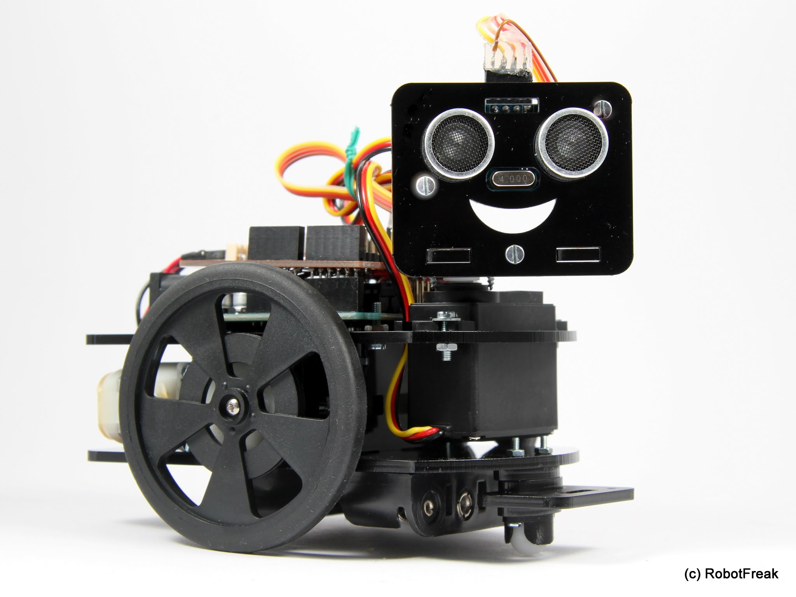

# Watterott Robot Starter Kit v2 (de)

Arduino Bibliothek und Beispiele für das Watterott Robot Starter Kit v2

## Basis Ausstattung:
* Watterott Starter Robot Kit (WSRK) Plexiglas Chassis, Motoren und Räder
* Arduino Uno 
* Arduino Motor Shield 
* Sharp GP2Y0A21YK0F Infrarot Distanz-Sensor an Pin A3
* Servo an Pin D5
* USB Kabel

## optionale Ausstattung:
* optional HC-SR04 Ultrascall Distanz Sensor an Pin D6, D7
* optional Pololu QTR-3A analoger Linien-Sensor an Pin A0,A1,A2
* optional Adafruit Bluefruit EZ-Link Modul
* Arduino Pro 5V anstelle Arduino Uno für einfachere Bluetooth Anbindung
* FTDI kompatibles USB serielles Modul/Kabel für Arduino Pro

## Modifikationen

* [Motoren entstören](Modifikationen/Motoren-Entstoeren-Mod.MD)
* [stärkere Motoren](Modifikationen/Staerkere-Motoren-Mod.MD)
* [Servo Stromversorgung](Modifikationen/Servo-Stromversorgungs-Mod.MD)
* [Sharp Stromversorgung](Modifikationen/Sharp-Sensor-Mod.MD)
* [Stromversorgung](Modifikationen/Stromversorgungs-Mod.MD)

## Erweiterungen

* [Ultraschall Sensor](Erweiterungen/HC-SR04-Erweiterung.MD)
* [Linien Sensor](Erweiterungen/Liniensensor-Erweiterung.MD)
* [Bluetooth](Erweiterungen/Bluetooth-Erweiterung.MD)

## Links

Für weitere Informationen  über Erweiterungen oder Modifications des Watterott Starter Robot
besuchen sie: http://www.robotfreak.de

Für Informationen zum Kauf des Watterott Starter Robot Kit (WSRK)
besuchen sie:  http://www.watterott.com/de/StarterKit-Roboter

# Watterott Robot Starter Kit v2 (en)

Arduino Library &amp; Examples for the Watterott Robot Starter Kit v2

## Basic Parts:
* Watterott Starter Robot Kit (WSRK) acrylic chassis, motors and wheels
* Arduino Uno 
* Arduino Motor Shield 
* Sharp GP2Y0A21YK0F Infrared distance sensor connected to A3
* Servo connected to Pin D5
* USB cable

## Optional Parts:
* optional HC-SR04 Ultrasonic distance sensor connected to pin D6, D7
* optional Pololu QTR-3A analog Line sensor connected to A0,A1,A2
* optional Adafruit Bluefruit EZ-Link Module
* Arduino Pro 5V instead of Arduno Uno for easy Bluetooth connection
* FTDI compatible USB serial module/cable for Arduino Pro

## Modifikations

* [Motors](Modifikationen/Motoren-Entstoeren-Mod.MD)
* [More powerfull motors](Modifikationen/Staerkere-Motoren-Mod.MD)
* [Servo power supply](Modifikationen/Servo-Stromversorgungs-Mod.MD)
* [Sharp power supply](Modifikationen/Sharp-Sensor-Mod.MD)
* [Power supply](Modifikationen/Stromversorgungs-Mod.MD)

## Expansions

* [Ultrasonic sensor](Erweiterungen/HC-SR04-Erweiterung.MD)
* [Line sensor](Erweiterungen/Liniensensor-Erweiterung.MD)
* [Bluetooth](Erweiterungen/Bluetooth-Erweiterung.MD)

## Links

For information about expansions or modifications of the Watterott Starter Robot
visit http://www.robotfreak.de for more information

For information about buying the Watterott Starter Robot Kit (WSRK)
visit http://www.watterott.com/de/StarterKit-Roboter
